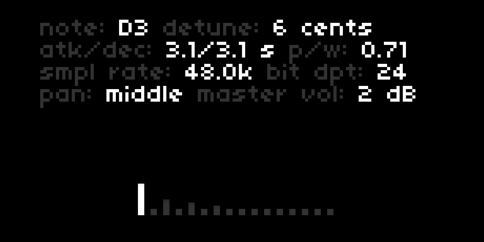

# Squares

A simple square wave drone synth with 16 independant square waves. Each voice is made of two square waves slighty detuned from each other. Each square wave pulsewidth can be modified. Sample rate and bit depth can be changed for each voice.

## Installation

Ensure you are up to date with the latest norns OS. Visit http://norns.local/ in a browser, and install squares by entering the following in the maiden REPL: 

`;install https://github.com/aidanreilly/squares`

Then, `SYSTEM => RESET` on norns to pick up the new SuperCollider engine. Reboot for good measure.

## Play

Select a root note and scale from the norns parameters menu. 16 frequencies based on the selected scale are applied. You can also tune the square waves by hand on norns. 

Controls:

* [E1] master volume
* [E2] select square 1-16
* [E3] set voice amplitude
* [K1] exit to norns main menu
* [K2] + [E2] change note
* [K2] + [E3] detune
* [K3] + [E2] change envelope
* [K3] + [E3] change pulsewidth
* [K1] + [E2] - change sample rate
* [K1] + [E3] - change bit depth
* [K2] + [K3] toggle voice pannning between 'middle' and odd numbered voices hard left, even numbered voices hard right. 

Saving a pset saves the note selection and midi mapping. The last saved pset is loaded when the app launches.

### Optional

Control individual square amplitudes, envelopes, bit depth, sample rate, and pulsewidth with a midi controller. Controls are mapped from the norns parameters page.

